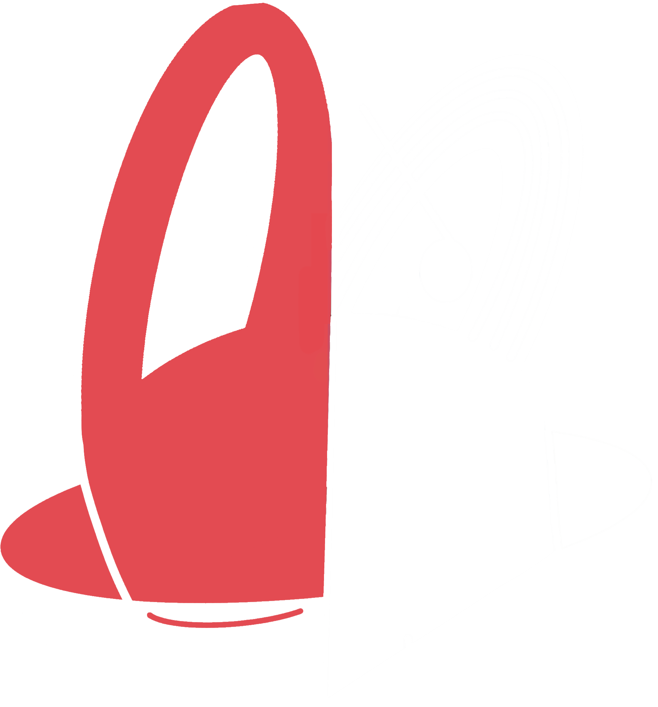

# Site de Présentation - Universal Tune Assistant (UTA)

<div align="center">
  
  <h3>Site de présentation du projet UTA</h3>
</div>

## 📑 À propos de ce site

Ce site web est une vitrine de présentation du projet **Universal Tune Assistant (UTA)**. Il a été conçu pour exposer de manière claire et interactive les différents aspects du projet, sa méthodologie et sa planification. Le site n'est pas l'application UTA elle-même, mais une interface de présentation destinée à expliquer le concept et l'organisation du projet.

## 🔍 Sections du site

Le site web présente les sections suivantes :

- **Introduction** : Présentation générale du projet UTA et de ses objectifs
- **Organisation & Équipe** : Structure de l'équipe, outils de gestion et matrice RACI
- **Système d'Information** : Architecture technique frontend, backend et DevOps
- **Analyse PESTEL** : Analyse des facteurs externes influençant le projet
- **Stratégie** : Approches stratégiques et choix d'orientation du projet
- **Roadmap** : Planification temporelle du développement
- **Architecture** : Conception technique détaillée par couches
- **Continuité de Service** : Stratégies PRA/PCA et gestion des risques
- **Analyse des Coûts** : Budget détaillé et retour sur investissement

## 🛠️ Technologies utilisées

Ce site de présentation est construit avec :

- **React & TypeScript** : Pour une interface interactive et typée
- **Vite** : Comme outil de build rapide et moderne
- **Tailwind CSS** : Pour un design responsive et élégant
- **Lucide Icons** : Pour les icônes vectorielles modernes
- **Animations CSS** : Pour des transitions fluides et une meilleure expérience utilisateur

## 💻 Lancer le site

### Prérequis

- Node.js (v14+)
- npm ou yarn

### Installation

1. Clonez ce dépôt :
   ```bash
   git clone https://github.com/Mkheir13/uta-pilotage.git
   cd uta-pilotage
   ```

2. Installez les dépendances :
   ```bash
   npm install
   # ou
   yarn
   ```

3. Démarrez le serveur de développement :
   ```bash
   npm run dev
   # ou
   yarn dev
   ```

4. Ouvrez [http://localhost:5173](http://localhost:5173) dans votre navigateur.

## 🎨 Personnalisation

Le site utilise une palette de couleurs basée sur le logo UTA :

- Rouge UTA: `#e34b52`
- Noir UTA: `#020102`
- Blanc UTA: `#ffffff`
- Accents: Dégradés de violet à rose

Ces couleurs peuvent être personnalisées dans le fichier `tailwind.config.js`.

## 📱 Compatibilité

Le site est entièrement responsive et optimisé pour :
- Ordinateurs de bureau
- Tablettes
- Smartphones

## 👥 Auteurs du site

- Pizzetta Antoine
- Mederreg Kheir-eddine
- Tomatis Margot

---

<div align="center">
  <p>Site de présentation créé avec ❤️ pour le projet UTA</p>
</div> 